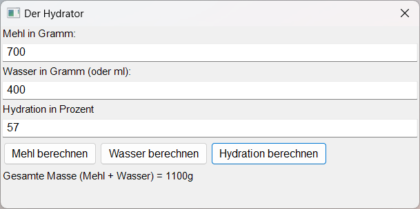

# Der Hydrator

Einfaches kleines Programm zur Berechnung von Mehl, Wasser und Hydrationsgehalt bei Mehlteigen.
Fertige Executables gibt es [hier](https://git.disroot.org/knusperhendl/Hydrator/releases)



Einfach zwei Werte eingeben und per Klick den Dritten Berechnen. Das lässt sich auch wie im folgenden Beispiel kombinieren.

## Anwendungsbeispiel

> Ich habe ein Rezept und möchte die Hydration leicht erhöhen/verringern

Zuerst Hydration ausrechnen:
1. Eingabe Mehl und Wasser
2. Klick *Hydration berechnen*
3. Berechneter Wert erscheint in der Hydrations Textbox

z.B. 400g Mehl, 200g Wasser -> 50% Hydration

Jetzt gewünschte Hydration im Hydrationfeld ersetzen, z.B. 50 mit 60. Jetzt Klick auf *Wasser berechnen* und es erscheint der korrekte neue Wert. (Natürlich auch mit *Mehl berechnen* möglich)

Konkret: 400g Mehl, 200g Wasser, **60% Hydration** --Klick--> 400g Mehl, **240g Wasser**, 60% Hydration.

## Build instruction

```bash
nimble install nigui # nigui dependancy
nim compile --app:gui -d:release -o:hydrator gui.nim
``` 
